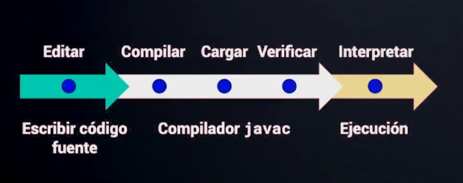

## JAVA-SE

      JAVA - 1991 - James Gosling - Sun Microsystems
      write one  , run anywhere

      Oracle compra Java (2009)
      JAVA SE (aplicaciones de escritorio offline)  - JAVA EE (integraciones web)

      - JDK (java development kit)
      |
      | -- Java Runtime Enviroment (JRE) (máquina virtual de Java)
      |
      |
      | -- Compilador Java (código Java --traduce a-->  Lenguaje ByteCode)
      |
      |
      | -- API's de desarrollo (librerias base)

      Oracle - Java -> SE 8 -> free
              -> SE 11 -> suscripcion

      Sun Microsystems - OpenJDK :
      -> Es la versión open-source de Java SE Plataform Edition
      
 ## ETAPAS DE COMPILACIÓN JAVA

    

 
 

    

      El compilador "JAVAC" compila los archivos ".java" a archivos ".class" en lenguaje máquina(byteCode)

    

      "JAVAC" -> compila los archivos .java
      "JVM" -> interpreta los archivos .class

## VARIABLE- (java class: Variables)

    

      Es un espacio en memoria al que le asignamos un contenido/valor

## CONVENCIÓN DE NOMBRES - (java class: NamingJava)

    

    

 

## TIPO DE DATOS NUMÉRICOS - (java class: DataType) 

    

    

