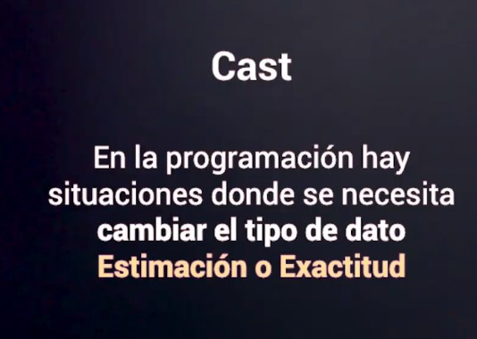
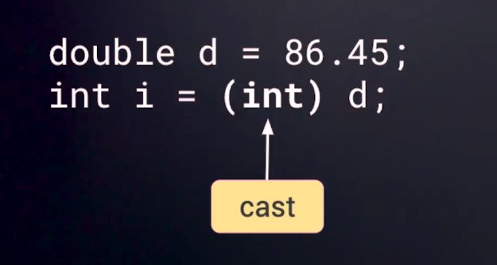
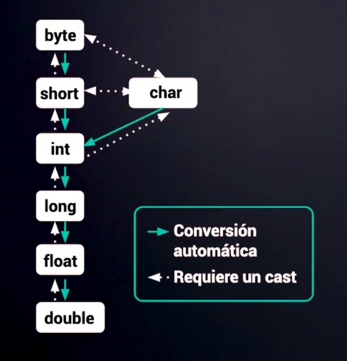

## INDEX
- [Java SE](#JAVA-SE)
- [Etapas de compilación Java](#etapas-de-compilación-java)
- [Variables](#VARIABLES)
- [Convención de nombres](#convención-de-nombres)
- [Tipos de datos](#tipos-de-datos)
- [Operadores](#operadores)
- [Casting de variables](#casting-de-variables)

## JAVA-SE

      JAVA - 1991 - James Gosling - Sun Microsystems
      write one  , run anywhere

      Oracle compra Java (2009)
      JAVA SE (aplicaciones de escritorio offline)  - JAVA EE (integraciones web)

      - JDK (java development kit)
      |
      | -- Java Runtime Enviroment (JRE) (máquina virtual de Java)
      |
      |
      | -- Compilador Java (código Java --traduce a-->  Lenguaje ByteCode)
      |
      |
      | -- API's de desarrollo (librerias base)

      Oracle - Java -> SE 8 -> free
              -> SE 11 -> suscripcion

      Sun Microsystems - OpenJDK :
      -> Es la versión open-source de Java SE Plataform Edition
      
## ETAPAS DE COMPILACIÓN JAVA

    

 
 

    

      El compilador "JAVAC" compila los archivos ".java" a archivos ".class" en lenguaje máquina(byteCode)

    

      "JAVAC" -> compila los archivos .java
      "JVM" -> interpreta los archivos .class

## VARIABLES
### (java class: Variables)

    

      Es un espacio en memoria al que le asignamos un contenido/valor

## CONVENCIÓN DE NOMBRES
### (java class: NamingJava)

    

    

 

## TIPOS DE DATOS
### (java class: DataType)
### TIPOS DE DATOS NUMÉRICOS

    

    

### TIPOS DE DATOS CHAR Y BOOLEAN

    

    

## OPERADORES
### OPERADOR DE ASIGNACIÓN

    

### OPERADOR DE INCREMENTO Y DECREMENTO - (java class: IncrementDecrement)

    

    

## CASTING DE VARIABLES
### CAST : EXACTITUD - ESTIMACIÓN 

    

    

### CAST : ENTRE TIPOS DE DATOS

    

